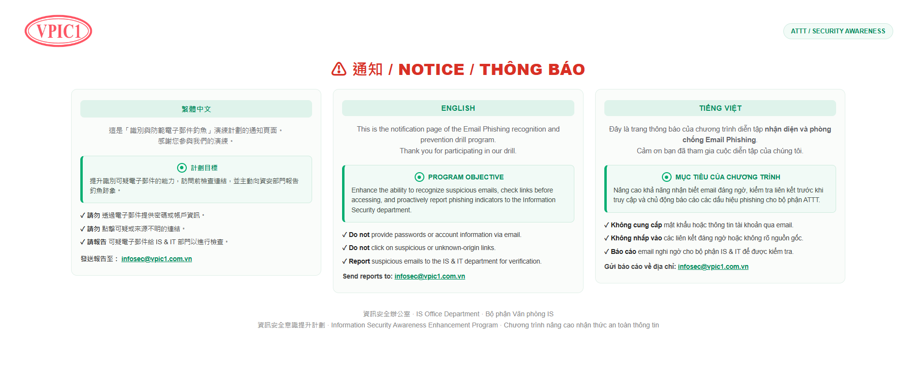

# Thông báo ATTT – VPIC1

Trang thông báo của chương trình diễn tập **nhận diện và phòng chống Email Phishing**, hiển thị bằng 3 ngôn ngữ: 繁體中文 · English · Tiếng Việt.




---

## Nội dung trang

- Thông báo người dùng đang tham gia chương trình diễn tập phishing
- Mục tiêu chương trình: nhận biết email đáng ngờ, kiểm tra liên kết, chủ động báo cáo
- Các khuyến nghị an toàn:
  - Không cung cấp mật khẩu hoặc thông tin tài khoản qua email
  - Không nhấp vào liên kết đáng ngờ hoặc không rõ nguồn gốc
  - Báo cáo email nghi ngờ cho bộ phận IS & IT
- Địa chỉ báo cáo: **infosec@vpic1.com.vn**

## Cấu trúc thư mục

```
.
├── index.html      # Trang thông báo (HTML + CSS, logo nhúng base64)
├── screenshot.png  # Ảnh chụp giao diện hiển thị trong README
└── README.md
```

Trang là một file HTML tĩnh duy nhất, không cần thư viện hay build. Giao diện tự co giãn: 3 cột trên màn hình rộng, 1 cột trên điện thoại.

## Triển khai bằng GitHub Pages

1. Đổi tên file HTML thành `index.html` rồi đẩy lên repo:
   ```bash
   git add .
   git commit -m "Thêm trang thông báo ATTT"
   git push
   ```
2. Vào repo trên GitHub → **Settings** → **Pages**.
3. Ở mục **Source**, chọn **Deploy from a branch**, branch `main`, thư mục `/ (root)` → **Save**.
4. Đợi 1–2 phút, trang sẽ có địa chỉ dạng `https://TEN-TAI-KHOAN.github.io/TEN-REPO/`.

## Xem trên máy

Mở trực tiếp file `index.html` bằng trình duyệt.

---

Bộ phận Văn phòng IS · Chương trình nâng cao nhận thức an toàn thông tin
